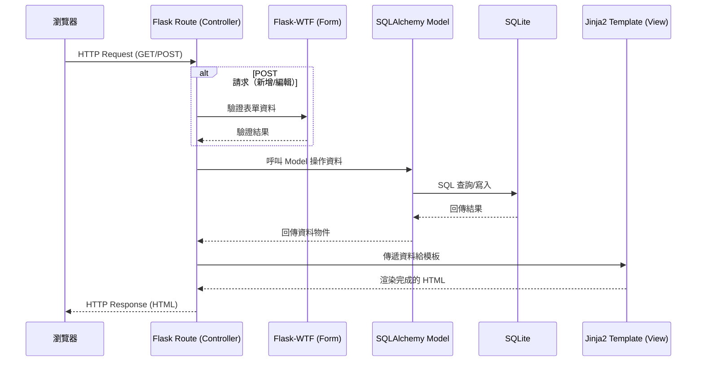
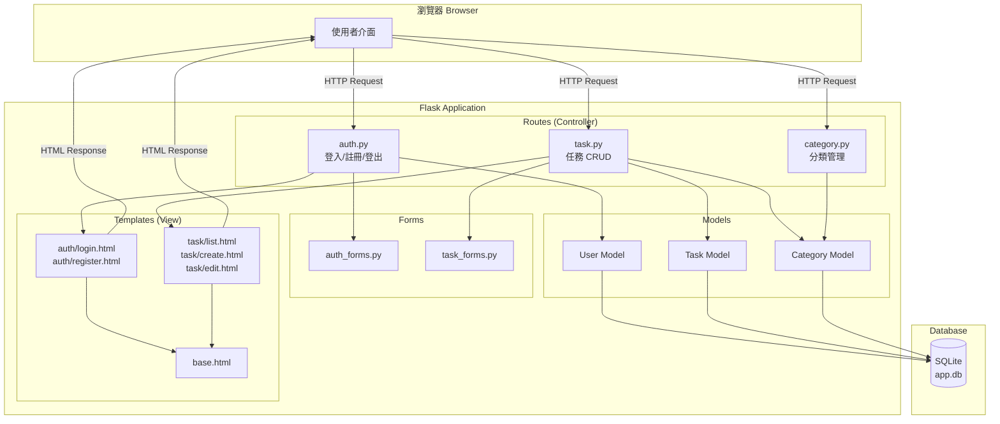
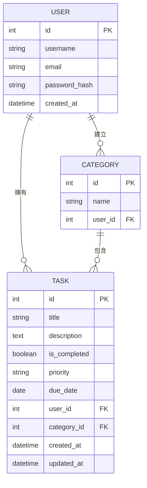

# 系統架構文件 — 任務管理系統

> **文件版本**：v1.0  
> **建立日期**：2026-04-09  
> **對應 PRD**：docs/PRD.md

---

## 1. 技術架構說明

### 1.1 選用技術與原因

| 技術 | 角色 | 選用原因 |
|------|------|---------|
| **Python 3** | 程式語言 | 語法簡潔易學，適合初學者與快速開發 |
| **Flask** | 後端框架（Controller） | 輕量級微框架，適合中小型專案，學習曲線低 |
| **Jinja2** | 模板引擎（View） | Flask 內建支援，可直接在 HTML 中嵌入 Python 邏輯 |
| **SQLite** | 資料庫 | 零設定、檔案型資料庫，適合開發與小型部署 |
| **SQLAlchemy** | ORM | 提供物件導向的資料庫操作，避免手寫 SQL，減少 SQL Injection 風險 |
| **Flask-Login** | 登入管理 | 處理使用者 session、登入狀態、路由保護 |
| **Flask-WTF** | 表單處理 | 提供表單驗證與 CSRF 防護 |
| **Werkzeug** | 密碼雜湊 | Flask 內建，提供 `generate_password_hash` / `check_password_hash` |

### 1.2 Flask MVC 模式說明

本專案採用 **MVC（Model-View-Controller）** 架構模式，將關注點分離：

```
┌─────────────────────────────────────────────────────────┐
│                      瀏覽器 (Browser)                     │
│                   使用者透過瀏覽器操作系統                    │
└──────────────┬──────────────────────┬────────────────────┘
               │ HTTP Request         ▲ HTTP Response (HTML)
               ▼                      │
┌──────────────────────────────────────────────────────────┐
│                 Controller（Flask Routes）                │
│                     app/routes/                           │
│                                                          │
│  • 接收 HTTP 請求（GET / POST）                            │
│  • 呼叫 Model 存取資料                                     │
│  • 將資料傳給 Template 渲染                                 │
│  • 回傳 HTML 給瀏覽器                                      │
└──────────┬───────────────────────────┬───────────────────┘
           │ 讀寫資料                    │ 傳遞資料
           ▼                            ▼
┌─────────────────────┐   ┌────────────────────────────────┐
│   Model（SQLAlchemy）│   │    View（Jinja2 Templates）     │
│    app/models/       │   │       app/templates/            │
│                      │   │                                 │
│ • 定義資料表結構       │   │ • HTML 頁面模板                  │
│ • 封裝資料庫操作       │   │ • 使用 Jinja2 語法顯示動態資料    │
│ • 資料驗證邏輯         │   │ • 繼承 base 模板確保一致性        │
└──────────┬───────────┘   └─────────────────────────────────┘
           │ SQL 操作
           ▼
┌─────────────────────┐
│   SQLite Database    │
│  instance/app.db     │
└─────────────────────┘
```

**三層職責總結：**

| 層級 | 對應資料夾 | 職責 |
|------|----------|------|
| **Model** | `app/models/` | 定義資料表結構（User、Task、Category）、資料庫 CRUD 操作 |
| **View** | `app/templates/` | HTML 頁面呈現、使用 Jinja2 動態渲染資料 |
| **Controller** | `app/routes/` | 接收 HTTP 請求、處理業務邏輯、協調 Model 與 View |

---

## 2. 專案資料夾結構

```
web_app_development/
│
├── docs/                        # 📄 專案文件
│   ├── PRD.md                   #    產品需求文件
│   ├── ARCHITECTURE.md          #    系統架構文件（本文件）
│   ├── DB_SCHEMA.md             #    資料庫設計文件
│   ├── API_ROUTES.md            #    API 路由設計文件
│   └── FLOWCHART.md             #    流程圖文件
│
├── app/                         # 🏠 主應用程式資料夾
│   ├── __init__.py              #    Flask App 工廠函式（create_app）
│   │
│   ├── models/                  # 📦 Model 層 — 資料庫模型
│   │   ├── __init__.py          #    匯出所有 Model
│   │   ├── user.py              #    User 模型（帳號、密碼雜湊）
│   │   ├── task.py              #    Task 模型（標題、描述、狀態、優先順序、到期日）
│   │   └── category.py          #    Category 模型（分類名稱、所屬使用者）
│   │
│   ├── routes/                  # 🛣️ Controller 層 — Flask 路由
│   │   ├── __init__.py          #    註冊所有 Blueprint
│   │   ├── auth.py              #    認證路由（登入、註冊、登出）
│   │   ├── task.py              #    任務路由（CRUD、狀態切換）
│   │   └── category.py          #    分類路由（新增、編輯、刪除分類）
│   │
│   ├── templates/               # 🎨 View 層 — Jinja2 HTML 模板
│   │   ├── base.html            #    基礎模板（共用 header、footer、navbar）
│   │   ├── auth/                #    認證相關頁面
│   │   │   ├── login.html       #       登入頁面
│   │   │   └── register.html    #       註冊頁面
│   │   └── task/                #    任務相關頁面
│   │       ├── list.html        #       任務列表（主頁）
│   │       ├── create.html      #       新增任務
│   │       └── edit.html        #       編輯任務
│   │
│   ├── static/                  # 📁 靜態資源
│   │   ├── css/
│   │   │   └── style.css        #    全站樣式
│   │   └── js/
│   │       └── main.js          #    前端互動邏輯（狀態切換、篩選等）
│   │
│   └── forms/                   # 📋 表單定義（Flask-WTF）
│       ├── __init__.py
│       ├── auth_forms.py        #    登入 / 註冊表單
│       └── task_forms.py        #    任務新增 / 編輯表單
│
├── instance/                    # 🗄️ 實例資料夾（不進 Git）
│   └── app.db                   #    SQLite 資料庫檔案
│
├── config.py                    # ⚙️ 應用程式設定（SECRET_KEY、DB URI 等）
├── app.py                       # 🚀 應用程式入口（啟動 Flask）
├── requirements.txt             # 📦 Python 套件依賴清單
├── .gitignore                   # 🚫 Git 忽略規則
└── README.md                    # 📖 專案說明
```

### 各資料夾用途說明

| 資料夾 / 檔案 | 用途 |
|--------------|------|
| `app/` | 主要應用程式程式碼，所有邏輯皆在此資料夾內 |
| `app/__init__.py` | **App 工廠函式**：使用 `create_app()` 模式初始化 Flask、載入設定、註冊 Blueprint、初始化資料庫 |
| `app/models/` | 定義所有 SQLAlchemy 資料表模型，對應資料庫中的 table |
| `app/routes/` | 使用 Flask **Blueprint** 分模組定義路由，保持程式碼整潔 |
| `app/templates/` | Jinja2 HTML 模板，透過 `` 實現模板繼承 |
| `app/static/` | CSS、JavaScript 等靜態檔案，由 Flask 自動提供 |
| `app/forms/` | Flask-WTF 表單類別，集中管理表單驗證規則 |
| `instance/` | 存放 SQLite 資料庫與其他不該進版控的檔案 |
| `config.py` | 集中管理環境設定（開發 / 測試 / 正式） |
| `app.py` | 應用程式入口點，執行 `python app.py` 啟動伺服器 |

---

## 3. 元件關係圖

### 3.1 請求處理流程



### 3.2 系統模組架構



### 3.3 Model 關聯圖



---

## 4. 關鍵設計決策

### 決策 1：使用 App Factory Pattern（工廠模式）

**決策**：使用 `create_app()` 函式建立 Flask 應用，而非直接在模組層級建立全域 `app` 物件。

**原因**：
- 支援不同環境設定（開發 / 測試 / 正式），只需傳入不同的 config
- 避免循環匯入（circular import）問題
- 方便撰寫單元測試，每個測試可以獨立建立 app 實例

**範例**：
```python
# app/__init__.py
def create_app(config_name='default'):
    app = Flask(__name__)
    app.config.from_object(config[config_name])
    
    db.init_app(app)
    login_manager.init_app(app)
    
    from .routes.auth import auth_bp
    from .routes.task import task_bp
    app.register_blueprint(auth_bp)
    app.register_blueprint(task_bp)
    
    return app
```

---

### 決策 2：使用 Blueprint 模組化路由

**決策**：將路由拆分為 `auth`、`task`、`category` 三個 Blueprint，而非全部寫在一個檔案。

**原因**：
- 每個模組職責清晰，易於維護
- 多人協作時可各自負責不同 Blueprint，降低衝突
- 可獨立設定 URL 前綴（如 `/auth/login`、`/task/create`）

---

### 決策 3：使用 SQLAlchemy ORM 而非原生 sqlite3

**決策**：透過 SQLAlchemy 操作資料庫，而非直接撰寫 SQL 語句。

**原因**：
- 以 Python 物件操作資料，程式碼更直覺易讀
- 自動處理參數化查詢，**大幅降低 SQL Injection 風險**
- 提供 Migration 工具（Flask-Migrate），方便未來修改資料表結構
- 若需更換資料庫（SQLite → PostgreSQL），只需修改連線字串

---

### 決策 4：密碼使用 Werkzeug 雜湊而非 bcrypt

**決策**：使用 Flask 內建的 `werkzeug.security` 進行密碼雜湊。

**原因**：
- **零額外安裝**：Werkzeug 是 Flask 的核心依賴，已自動安裝
- 提供 `generate_password_hash()` 與 `check_password_hash()` 兩個簡潔 API
- 預設使用 `scrypt` 演算法，安全性足夠

---

### 決策 5：表單驗證集中在 Flask-WTF

**決策**：使用 Flask-WTF 定義表單類別，集中處理驗證與 CSRF 防護。

**原因**：
- 自動產生 CSRF Token，防止跨站請求偽造攻擊
- 驗證邏輯集中在 Form 類別中，Controller 只需呼叫 `form.validate_on_submit()`
- 可重複使用表單物件，避免在每個路由中重複寫驗證邏輯

---

## 5. 依賴套件清單

```
Flask==3.1.*
Flask-SQLAlchemy==3.1.*
Flask-Login==0.6.*
Flask-WTF==1.2.*
```

---

> **下一步**：完成架構設計後，進入流程圖設計（`/flowchart`）或資料庫設計（`/db-design`）。
