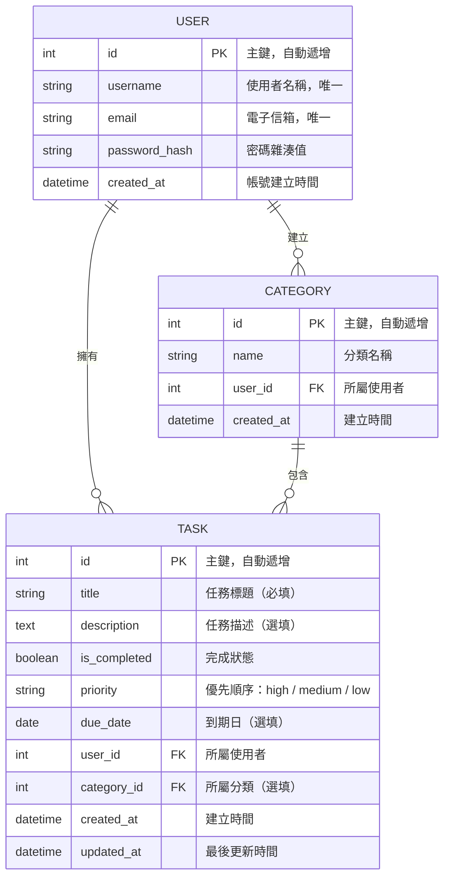

# 資料庫設計文件 — 任務管理系統

> **文件版本**：v1.0  
> **建立日期**：2026-04-16  
> **對應文件**：docs/PRD.md、docs/ARCHITECTURE.md、docs/FLOWCHART.md

---

## 1. ER 圖（實體關係圖）

---

## 2. 資料表詳細說明

### 2.1 users — 使用者

儲存使用者帳號資訊，支援註冊、登入、登出功能。

| 欄位 | 型別 | 必填 | 預設值 | 說明 |
|------|------|------|--------|------|
| `id` | INTEGER | ✅ | AUTO INCREMENT | 主鍵 |
| `username` | VARCHAR(80) | ✅ | — | 使用者名稱，唯一且不可重複 |
| `email` | VARCHAR(120) | ✅ | — | 電子信箱，唯一且不可重複 |
| `password_hash` | VARCHAR(256) | ✅ | — | 經 Werkzeug 雜湊後的密碼 |
| `created_at` | DATETIME | ✅ | 目前時間 | 帳號建立時間 |

**索引**：
- `PRIMARY KEY (id)`
- `UNIQUE (username)`
- `UNIQUE (email)`

**關聯**：
- 一對多 → `tasks`（一個使用者擁有多筆任務）
- 一對多 → `categories`（一個使用者擁有多個分類）

---

### 2.2 tasks — 任務

核心資料表，儲存所有任務資訊。

| 欄位 | 型別 | 必填 | 預設值 | 說明 |
|------|------|------|--------|------|
| `id` | INTEGER | ✅ | AUTO INCREMENT | 主鍵 |
| `title` | VARCHAR(200) | ✅ | — | 任務標題 |
| `description` | TEXT | ❌ | — | 任務描述 |
| `is_completed` | BOOLEAN | ✅ | FALSE | 完成狀態（false = 未完成） |
| `priority` | VARCHAR(10) | ✅ | `'medium'` | 優先順序：`high` / `medium` / `low` |
| `due_date` | DATE | ❌ | NULL | 任務到期日 |
| `user_id` | INTEGER | ✅ | — | 外鍵，關聯 `users.id` |
| `category_id` | INTEGER | ❌ | NULL | 外鍵，關聯 `categories.id` |
| `created_at` | DATETIME | ✅ | 目前時間 | 任務建立時間 |
| `updated_at` | DATETIME | ✅ | 目前時間 | 最後更新時間（每次更新自動變更） |

**索引**：
- `PRIMARY KEY (id)`
- `FOREIGN KEY (user_id) REFERENCES users(id)`
- `FOREIGN KEY (category_id) REFERENCES categories(id)`
- `INDEX (user_id)` — 加速查詢使用者的任務
- `INDEX (user_id, is_completed)` — 加速依完成狀態篩選

**關聯**：
- 多對一 → `users`（每筆任務屬於一個使用者）
- 多對一 → `categories`（每筆任務可屬於一個分類，可為 NULL）

---

### 2.3 categories — 分類

讓使用者自訂任務分類（如：工作、學習、生活）。

| 欄位 | 型別 | 必填 | 預設值 | 說明 |
|------|------|------|--------|------|
| `id` | INTEGER | ✅ | AUTO INCREMENT | 主鍵 |
| `name` | VARCHAR(50) | ✅ | — | 分類名稱 |
| `user_id` | INTEGER | ✅ | — | 外鍵，關聯 `users.id` |
| `created_at` | DATETIME | ✅ | 目前時間 | 分類建立時間 |

**索引**：
- `PRIMARY KEY (id)`
- `FOREIGN KEY (user_id) REFERENCES users(id)`
- `UNIQUE (name, user_id)` — 同一使用者不可建立同名分類

**關聯**：
- 多對一 → `users`（每個分類屬於一個使用者）
- 一對多 → `tasks`（一個分類可包含多筆任務）

---

## 3. 設計決策

### 3.1 任務刪除策略

當分類被刪除時，該分類下的任務 **不會被刪除**，而是將 `category_id` 設為 `NULL`（SET NULL）。這確保使用者不會因為刪除分類而意外遺失任務。

### 3.2 優先順序使用字串而非整數

`priority` 欄位使用 `'high'` / `'medium'` / `'low'` 字串值，而非 `1` / `2` / `3` 整數。原因是：
- 程式碼可讀性更高，不需要記住數字對應的意義
- Jinja2 模板中可直接顯示，無需額外轉換

### 3.3 時間欄位使用 DATETIME

所有時間欄位使用 Python `datetime.utcnow()` 儲存 UTC 時間，由 SQLAlchemy 自動處理格式轉換。

---

## 4. SQL 建表語法

完整的 CREATE TABLE SQL 語法存放於 `database/schema.sql`，可直接用於初始化資料庫。

---

> **下一步**：完成資料庫設計後，進入路由設計（`/api-design`）。
