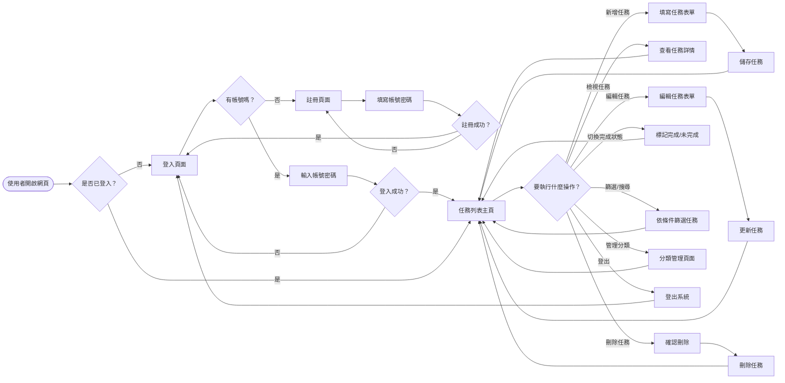
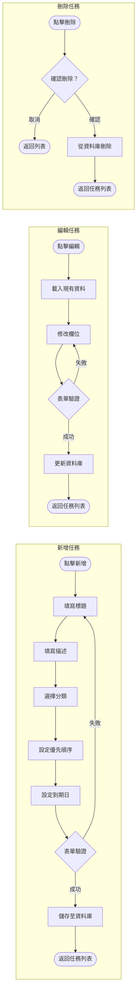
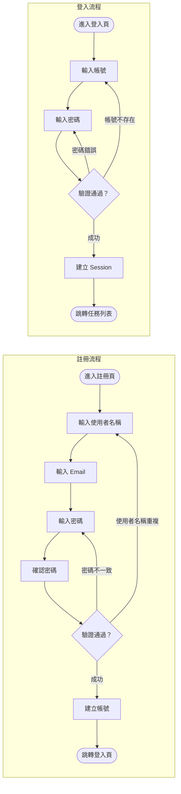
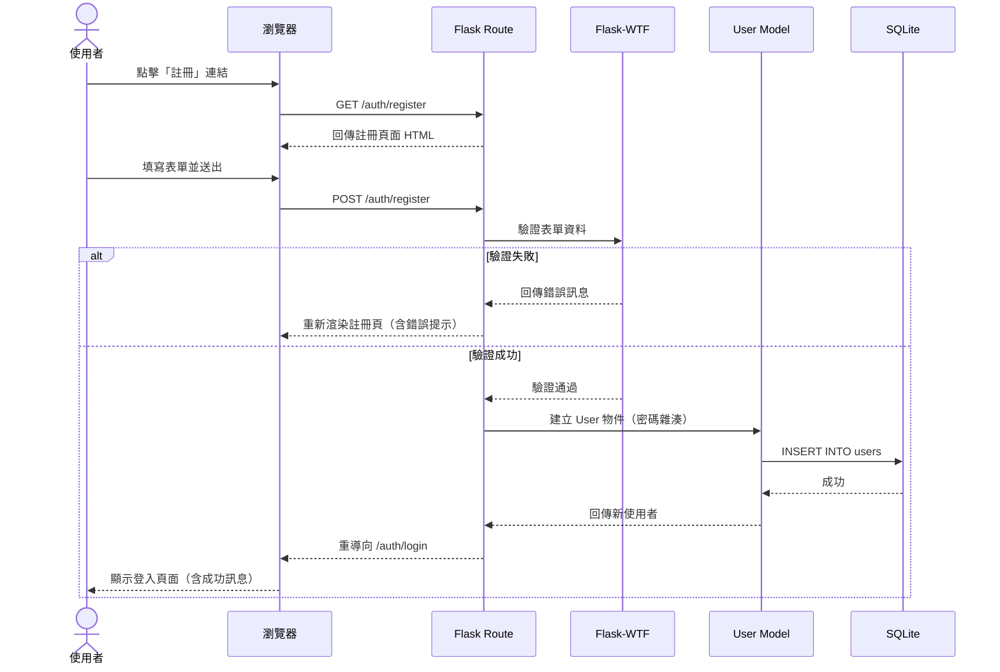
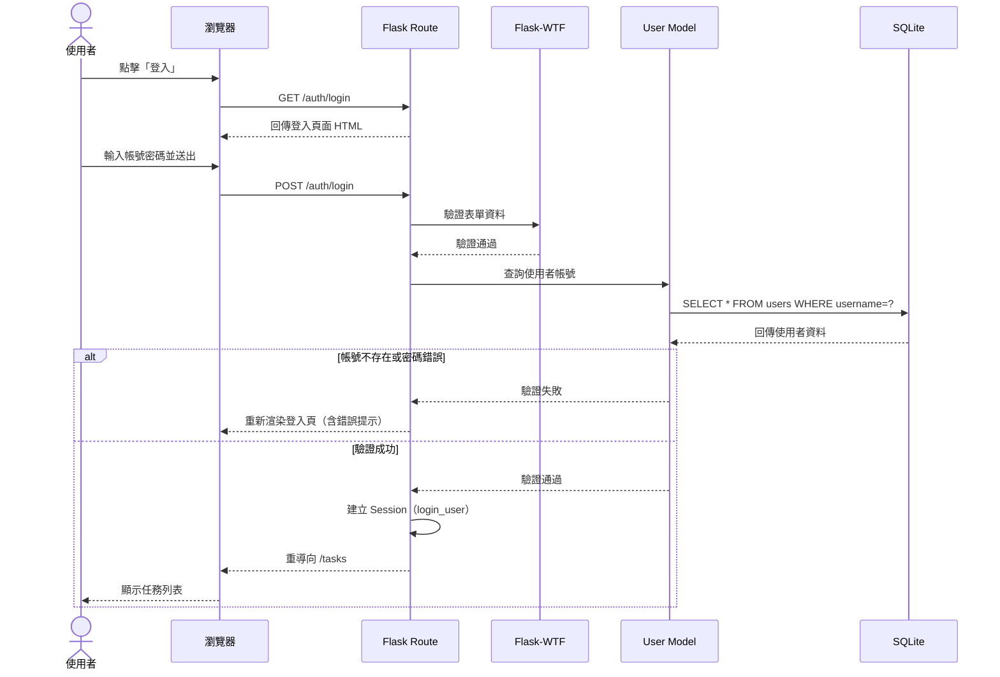
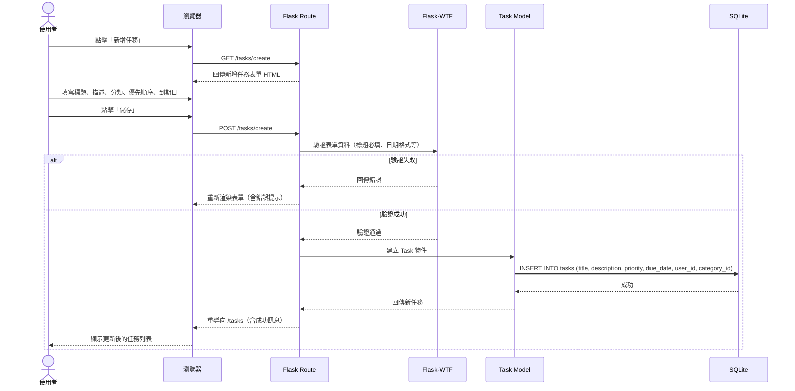
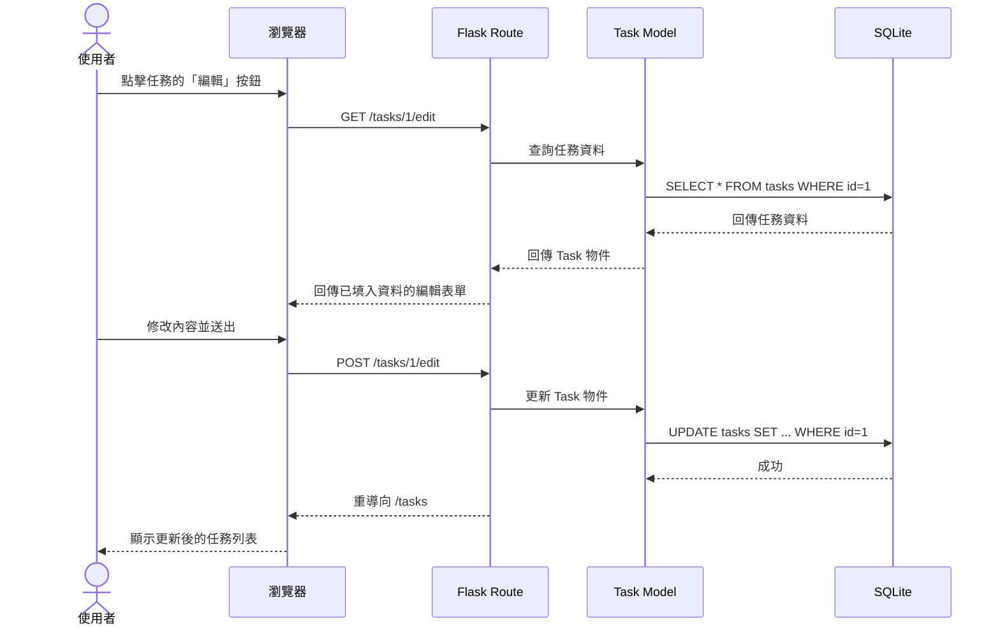
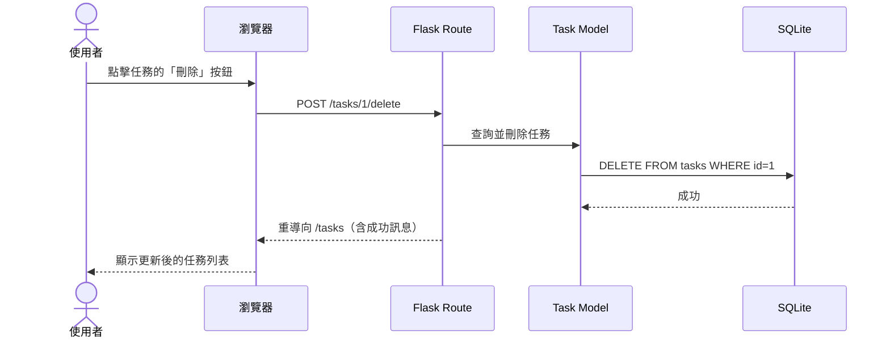
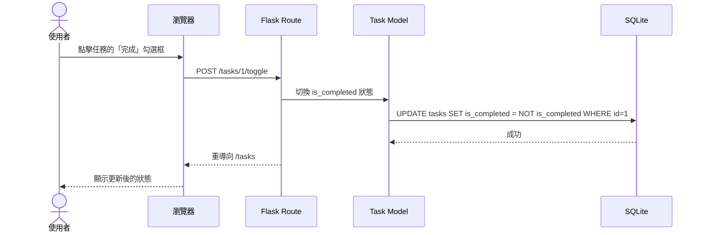

# 流程圖文件 — 任務管理系統

> **文件版本**：v1.0  
> **建立日期**：2026-04-09  
> **對應文件**：docs/PRD.md、docs/ARCHITECTURE.md

---

## 1. 使用者流程圖（User Flow）

### 1.1 整體操作流程

從使用者進入網站開始，涵蓋認證、任務管理、分類管理等所有主要功能的操作路徑。

### 1.2 任務 CRUD 詳細流程

### 1.3 認證流程

---

## 2. 系統序列圖（Sequence Diagram）

### 2.1 使用者註冊流程

### 2.2 使用者登入流程

### 2.3 新增任務流程

### 2.4 編輯任務流程

### 2.5 刪除任務流程

### 2.6 切換完成狀態流程

---

## 3. 功能清單對照表

| 功能 | URL 路徑 | HTTP 方法 | 說明 |
|------|---------|-----------|------|
| 首頁（任務列表） | `/tasks` | GET | 顯示目前使用者的所有任務 |
| 新增任務頁面 | `/tasks/create` | GET | 顯示新增任務表單 |
| 新增任務 | `/tasks/create` | POST | 處理表單送出，建立新任務 |
| 編輯任務頁面 | `/tasks/<id>/edit` | GET | 顯示編輯任務表單（含現有資料） |
| 編輯任務 | `/tasks/<id>/edit` | POST | 處理表單送出，更新任務 |
| 刪除任務 | `/tasks/<id>/delete` | POST | 刪除指定任務 |
| 切換完成狀態 | `/tasks/<id>/toggle` | POST | 切換任務的完成 / 未完成狀態 |
| 搜尋與篩選 | `/tasks?q=&category=&priority=&status=` | GET | 依條件篩選任務列表 |
| 註冊頁面 | `/auth/register` | GET | 顯示註冊表單 |
| 註冊 | `/auth/register` | POST | 處理註冊表單，建立帳號 |
| 登入頁面 | `/auth/login` | GET | 顯示登入表單 |
| 登入 | `/auth/login` | POST | 處理登入驗證 |
| 登出 | `/auth/logout` | GET | 登出並清除 Session |
| 分類列表 | `/categories` | GET | 顯示使用者的所有分類 |
| 新增分類 | `/categories/create` | POST | 建立新分類 |
| 編輯分類 | `/categories/<id>/edit` | POST | 更新分類名稱 |
| 刪除分類 | `/categories/<id>/delete` | POST | 刪除指定分類 |

---

> **下一步**：完成流程圖後，進入資料庫設計（`/db-design`）。
